# Trackfluence — Architecture Diagrams

> **Version:** 1.0 | **Date:** May 2026  
> All diagrams use Mermaid syntax (rendered in GitHub, GitLab, Notion, and most markdown viewers)

---

## 1. System Context — 30,000-Foot View

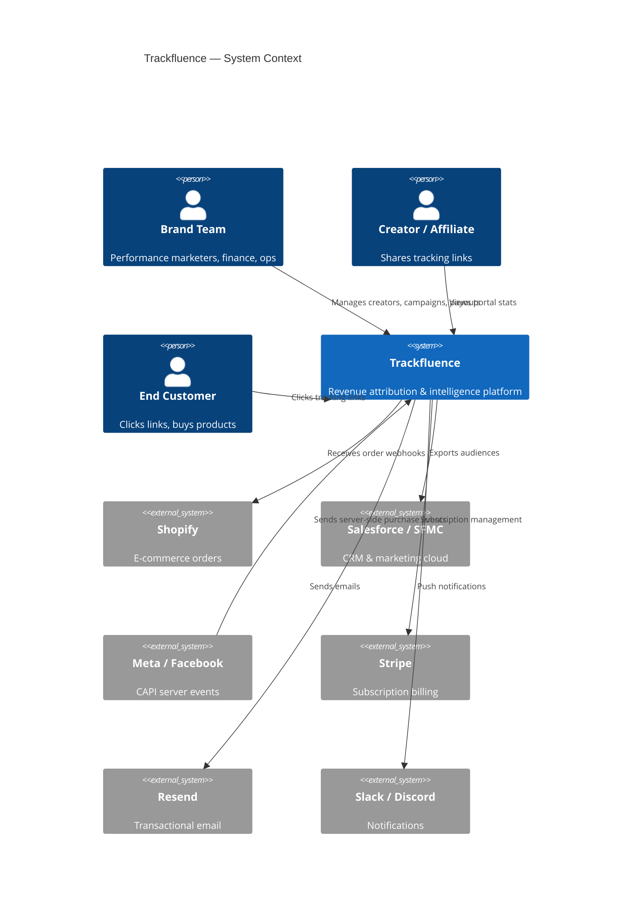

---

## 2. Monorepo Package Structure

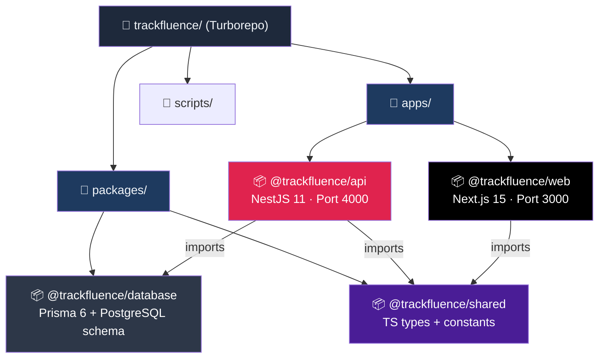

---

## 3. API Request Flow — From Browser to Database

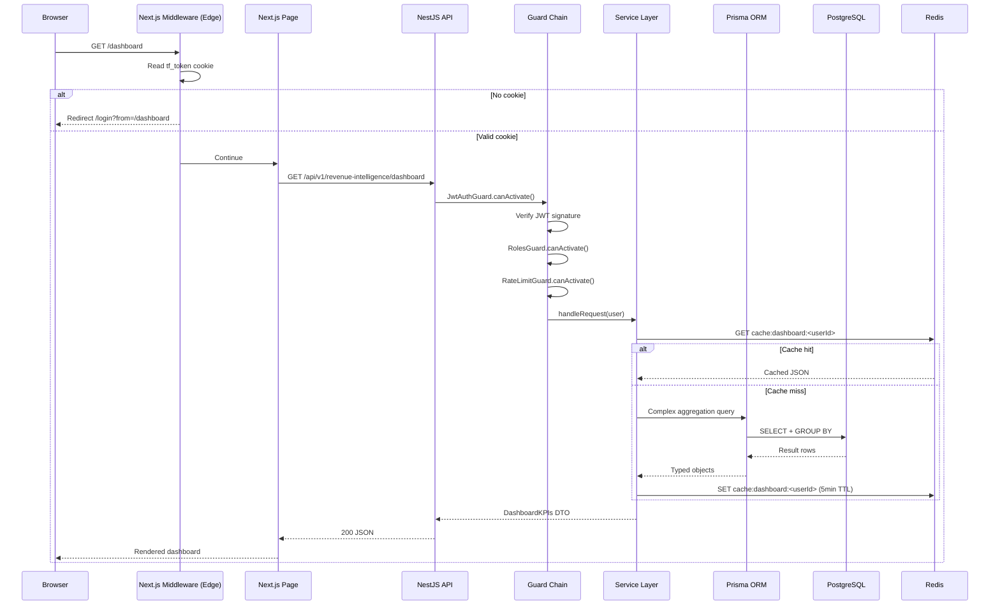

---

## 4. Attribution Pipeline — Click to Commission

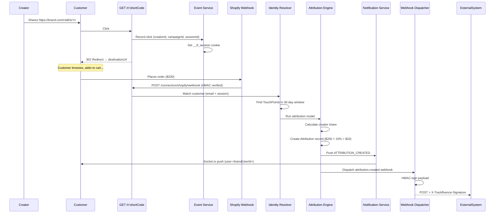

---

## 5. Guard Chain — API Security Layers

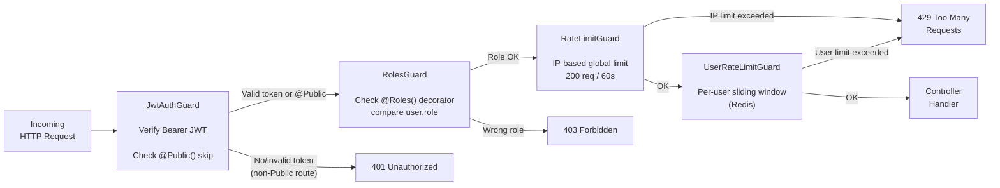

---

## 6. Real-Time Events — Socket.io Architecture

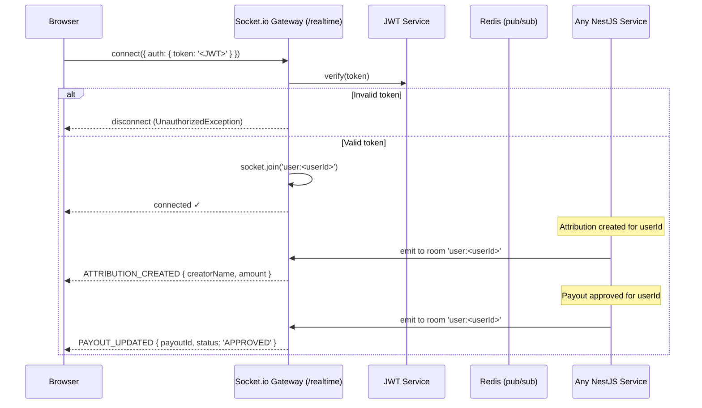

---

## 7. Multi-Tenancy Model

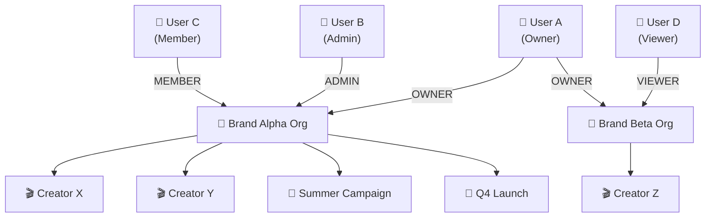

**Role permissions:**

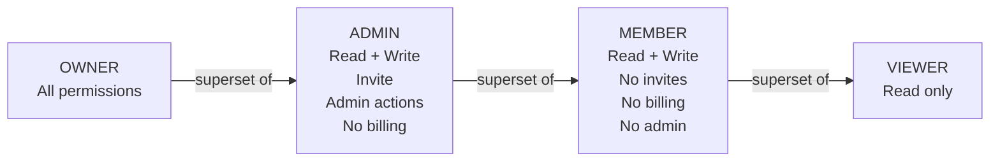

---

## 8. Billing & Plan Enforcement Flow

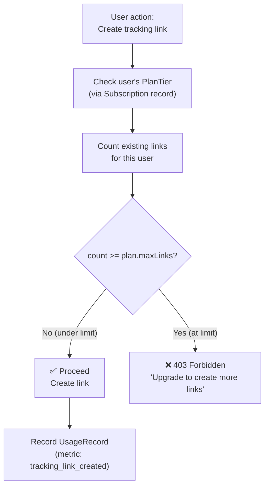

---

## 9. Payout Lifecycle State Machine

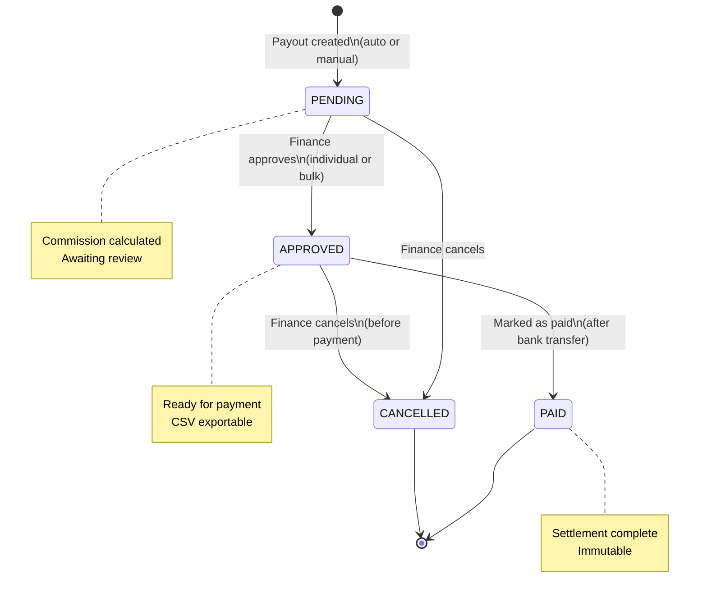

---

## 10. Creator Score Calculation

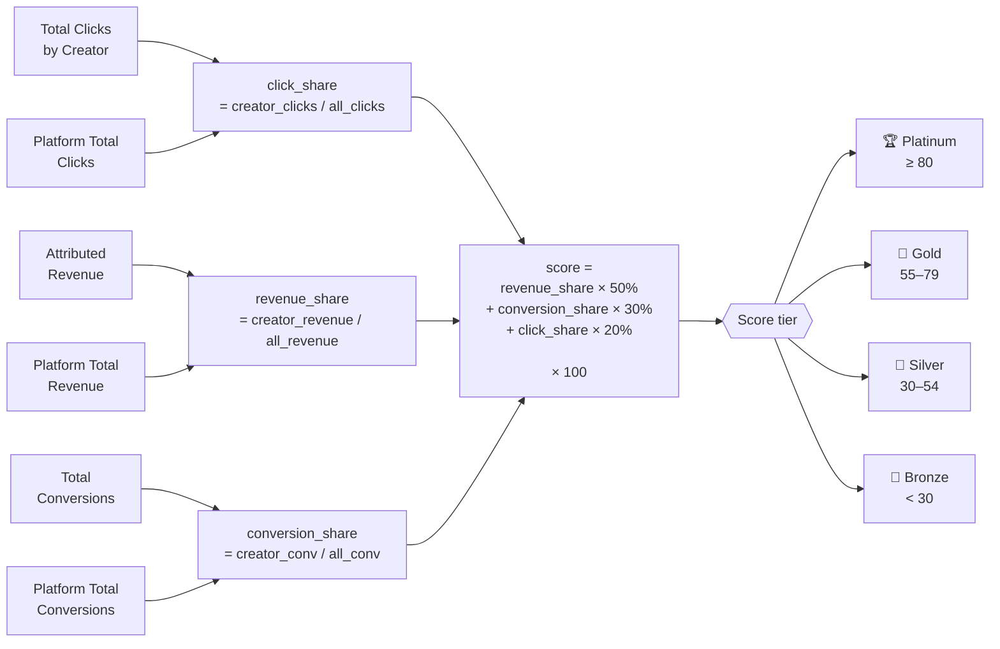

---

## 11. Docker Compose — Local Dev Stack

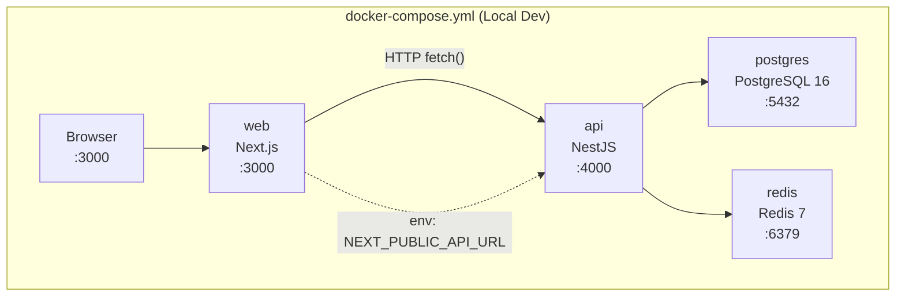

---

## 12. Railway Production Deployment

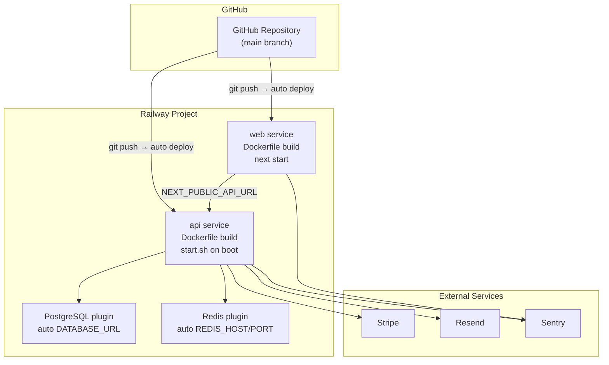

---

## 13. Identity Resolution Pipeline

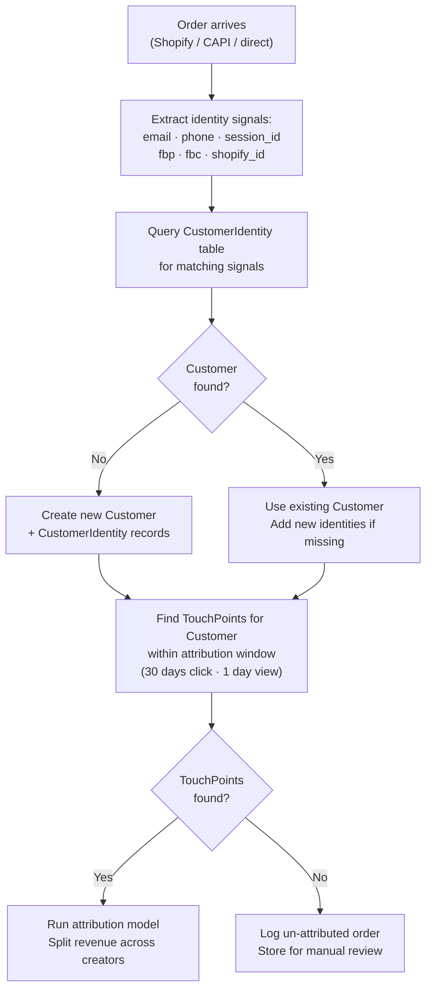

---

## 14. FTC Compliance Flow

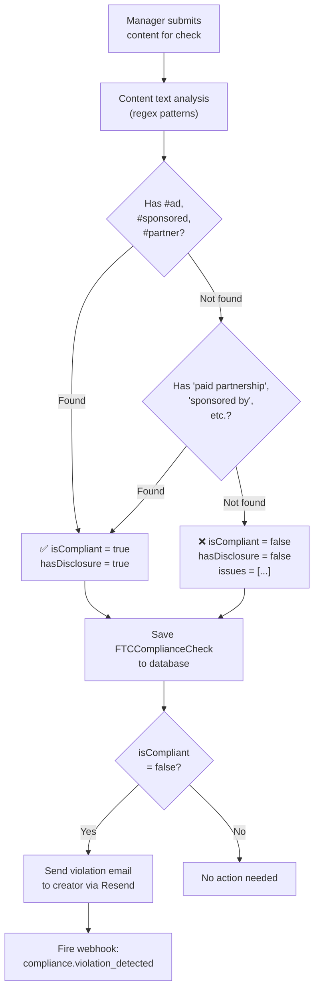

---

*Architecture diagrams v1.0 — May 2026 — Trackfluence*
