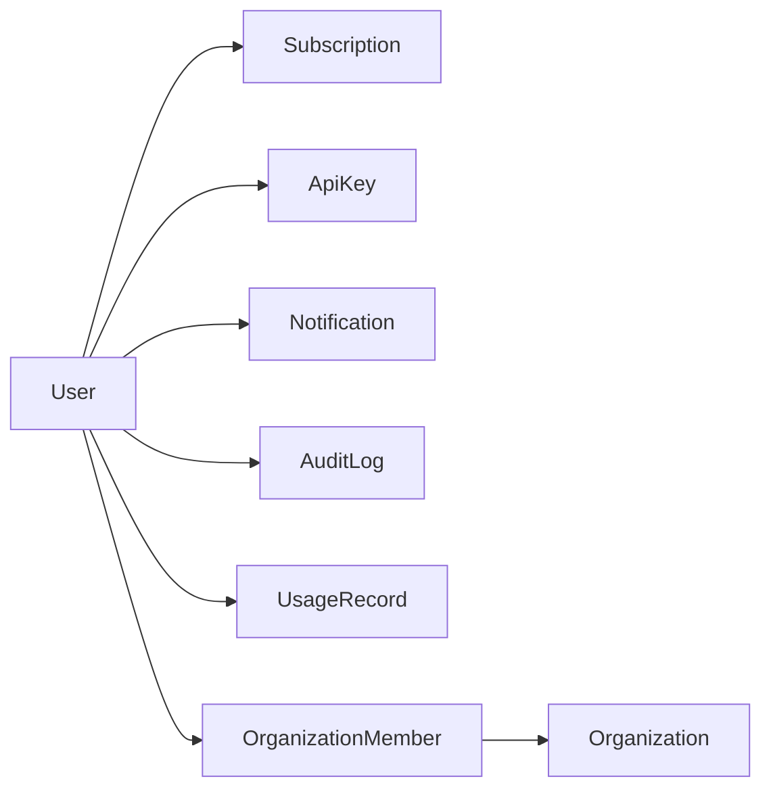
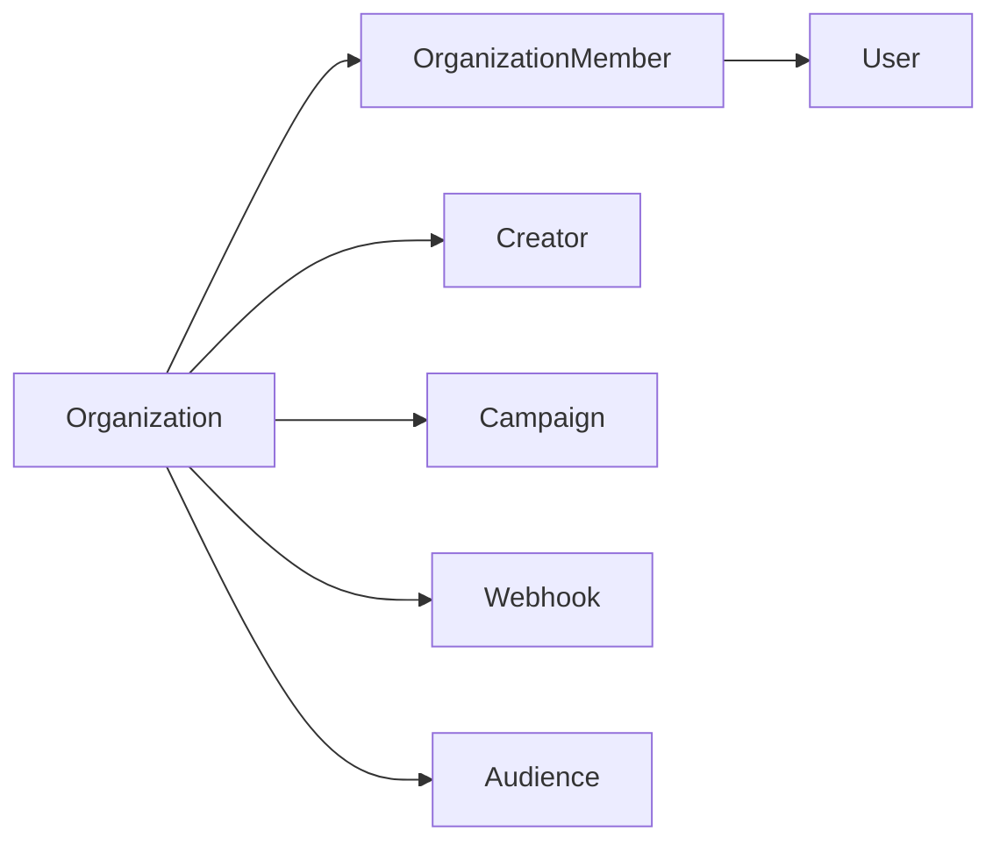
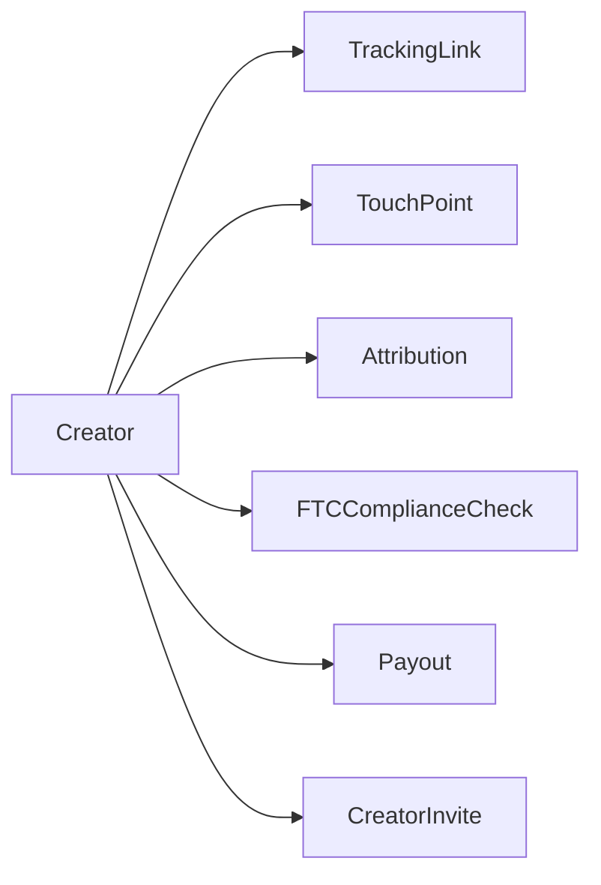
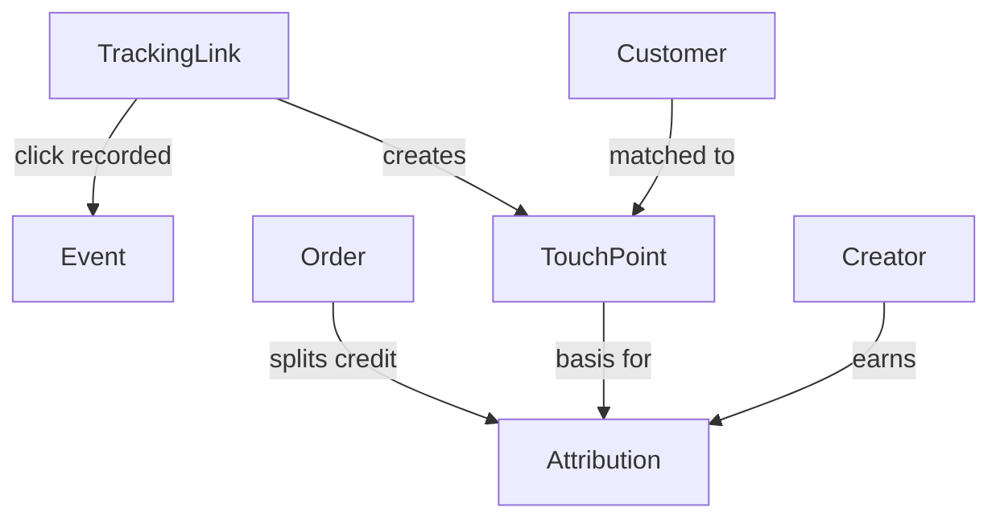
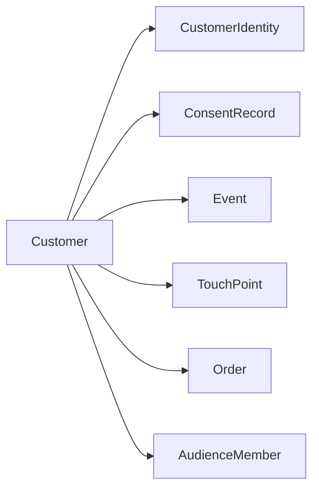
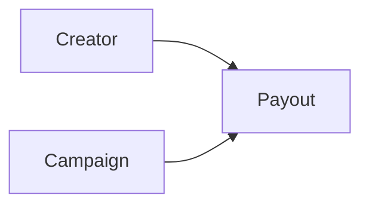
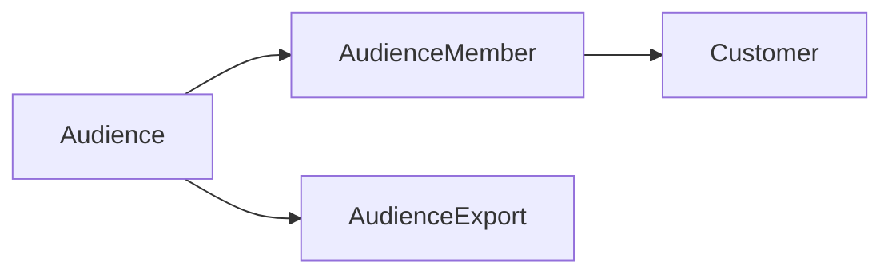
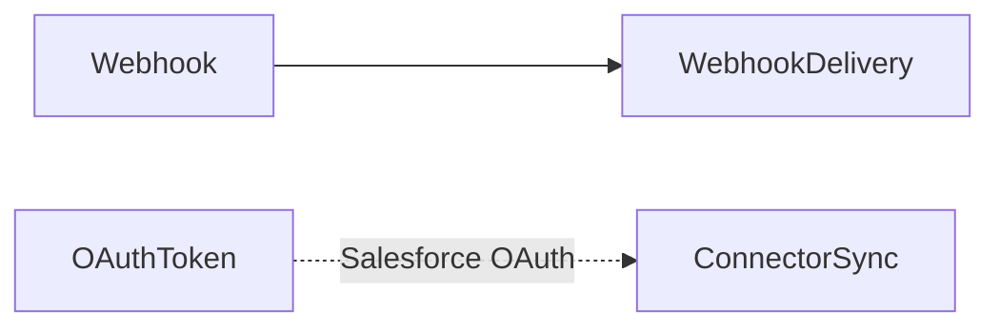

# Trackfluence — Database ERD & Data Model Reference

> All 28 Prisma models, 15 enumerations, and their relationships

---

## 1. Entity Relationship Overview

```mermaid
erDiagram
    User {
        string id PK
        string email UK
        string passwordHash
        string name
        UserRole role
        datetime createdAt
        datetime updatedAt
    }

    Subscription {
        string id PK
        string userId UK,FK
        string stripeCustomerId UK
        string stripeSubscriptionId UK
        string stripePriceId
        PlanTier plan
        SubscriptionStatus status
        datetime currentPeriodStart
        datetime currentPeriodEnd
        boolean cancelAtPeriodEnd
    }

    ApiKey {
        string id PK
        string userId FK
        string name
        string keyHash UK
        string keyPrefix
        string[] scopes
        datetime lastUsedAt
        datetime expiresAt
        datetime revokedAt
    }

    Notification {
        string id PK
        string userId FK
        string type
        string title
        string body
        string link
        datetime readAt
    }

    AuditLog {
        string id PK
        string userId FK
        string action
        string entityType
        string entityId
        json details
        string ip
    }

    Organization {
        string id PK
        string name
        string slug UK
        string domain
        string slackWebhookUrl
        string discordWebhookUrl
    }

    OrganizationMember {
        string id PK
        string orgId FK
        string userId FK
        OrgRole role
    }

    Creator {
        string id PK
        string externalId UK
        string name
        string email UK
        string platform
        string handle
        string organizationId FK
        decimal commissionRate
    }

    CreatorInvite {
        string id PK
        string creatorId UK,FK
        string token UK
        string email
        datetime expiresAt
    }

    Campaign {
        string id PK
        string name
        decimal budget
        string currency
        datetime startDate
        datetime endDate
        string status
        string organizationId
    }

    TrackingLink {
        string id PK
        string shortCode UK
        string creatorId FK
        string campaignId FK
        string destinationUrl
        TrackingLinkType type
        string promoCode UK
        int clickCount
    }

    Event {
        string id PK
        string eventName
        EventCategory category
        datetime timestamp
        string sessionId
        string customerId FK
        string trackingLinkId FK
        string deduplicationKey UK
    }

    Customer {
        string id PK
        string externalId UK
        string email UK
        string phone
        boolean creatorAcquired
        string acquisitionCreatorId
        decimal totalRevenue
        int orderCount
        decimal ltv
    }

    CustomerIdentity {
        string id PK
        string customerId FK
        IdentityType identityType
        string identityValue
        float confidence
    }

    ConsentRecord {
        string id PK
        string customerId UK,FK
        ConsentStatus gdprConsent
        boolean ccpaOptOut
    }

    TouchPoint {
        string id PK
        string customerId FK
        string creatorId FK
        string trackingLinkId FK
        string channel
        InteractionType interactionType
        datetime timestamp
    }

    Order {
        string id PK
        string externalId UK
        string customerId FK
        decimal totalAmount
        string currency
        OrderStatus status
        datetime orderDate
    }

    Attribution {
        string id PK
        string orderId FK
        string customerId FK
        string creatorId FK
        string touchpointId FK
        AttributionModel model
        decimal attributedRevenue
        float attributionWeight
    }

    Payout {
        string id PK
        string creatorId FK
        string campaignId FK
        decimal amount
        string currency
        PayoutStatus status
        datetime periodStart
        datetime periodEnd
    }

    Audience {
        string id PK
        string name
        json rules
        int customerCount
        string organizationId
    }

    AudienceMember {
        string id PK
        string audienceId FK
        string customerId FK
        datetime addedAt
    }

    AudienceExport {
        string id PK
        string audienceId FK
        string destination
        ExportStatus status
        int exportedCount
    }

    FTCComplianceCheck {
        string id PK
        string creatorId FK
        string contentUrl
        ContentType contentType
        boolean hasDisclosure
        boolean isCompliant
    }

    Webhook {
        string id PK
        string url
        string secret
        string[] events
        WebhookStatus status
        string organizationId
    }

    WebhookDelivery {
        string id PK
        string webhookId FK
        string event
        json payload
        boolean success
        int responseStatus
    }

    OAuthToken {
        string id PK
        string provider UK
        string instanceUrl
        string accessToken
        string refreshToken
        datetime expiresAt
    }

    ConnectorSync {
        string id PK
        string connectorType
        string direction
        ExportStatus status
        int recordsCount
    }

    UsageRecord {
        string id PK
        string userId FK
        string metric
        int quantity
        datetime recordedAt
    }

    User ||--o{ Subscription : "has"
    User ||--o{ ApiKey : "owns"
    User ||--o{ Notification : "receives"
    User ||--o{ AuditLog : "triggers"
    User ||--o{ UsageRecord : "tracked by"
    User ||--o{ OrganizationMember : "belongs to"

    Organization ||--o{ OrganizationMember : "has"
    Organization ||--o{ Creator : "owns"
    Organization ||--o{ Campaign : "owns"
    Organization ||--o{ Webhook : "configures"
    Organization ||--o{ Audience : "owns"

    Creator ||--o{ TrackingLink : "has"
    Creator ||--o{ TouchPoint : "generates"
    Creator ||--o{ Attribution : "earns"
    Creator ||--o{ FTCComplianceCheck : "subject of"
    Creator ||--o{ Payout : "receives"
    Creator ||--|| CreatorInvite : "invited via"

    Campaign ||--o{ Payout : "linked to"

    TrackingLink ||--o{ Event : "records"
    TrackingLink ||--o{ TouchPoint : "creates"

    Customer ||--o{ CustomerIdentity : "identified by"
    Customer ||--|| ConsentRecord : "has"
    Customer ||--o{ Event : "triggers"
    Customer ||--o{ TouchPoint : "has"
    Customer ||--o{ Order : "places"
    Customer ||--o{ Attribution : "attributed to"
    Customer ||--o{ AudienceMember : "member of"

    Order ||--o{ Attribution : "split across"

    TouchPoint ||--o{ Attribution : "base for"

    Audience ||--o{ AudienceMember : "contains"
    Audience ||--o{ AudienceExport : "exported via"

    Webhook ||--o{ WebhookDelivery : "logs"
```



---

## 2. Domain Groups

### 2.1 Identity & Auth Domain



| Model | Purpose |
|-------|---------|
| `User` | Platform accounts (brand team members) |
| `Subscription` | Stripe subscription state (1:1 with User) |
| `ApiKey` | Programmatic access credentials |
| `Notification` | In-app notifications inbox |
| `AuditLog` | Admin action audit trail |
| `UsageRecord` | Plan limit tracking (clicks, attribution runs, etc.) |

---

### 2.2 Organization & Multi-Tenancy Domain



| Model | Purpose |
|-------|---------|
| `Organization` | Workspace / tenant (a brand) |
| `OrganizationMember` | User ↔ Org join with `OrgRole` |

**OrgRole hierarchy:**
```
OWNER > ADMIN > MEMBER > VIEWER
```

---

### 2.3 Creator Domain



| Model | Purpose |
|-------|---------|
| `Creator` | Influencer / affiliate profile |
| `CreatorInvite` | Token-based invite for creator portal access |
| `FTCComplianceCheck` | Content disclosure check records |

**Commission rate storage:** `Decimal(5,4)` — e.g. `0.1000 = 10.00%`

---

### 2.4 Attribution Core Domain

This is the heart of the system. The attribution pipeline flows:

```
TrackingLink → (click) → Event + TouchPoint
                                   ↓
                              (order arrives)
                                   ↓
                              Attribution
                              (Order → TouchPoint → Creator)
```



| Model | Purpose |
|-------|---------|
| `TrackingLink` | Short URLs with UTM + promo code tracking |
| `Event` | Raw browser/server events (click, purchase, etc.) |
| `TouchPoint` | Cleaned touchpoint record (Creator ↔ Customer interaction) |
| `Order` | Revenue event (from Shopify, CAPI, or direct API) |
| `Attribution` | Final attribution record — creator's share of an order |

**Attribution models stored per record:**
```
FIRST_TOUCH | LAST_TOUCH | LINEAR | TIME_DECAY
```
Multiple `Attribution` rows can exist per `Order` (one per model or per creator split).

---

### 2.5 Customer Identity Domain



| Model | Purpose |
|-------|---------|
| `Customer` | Unified customer profile (aggregated from all sources) |
| `CustomerIdentity` | Multi-signal identity store (email hash, FBP, FBC, session ID, etc.) |
| `ConsentRecord` | GDPR/CCPA consent state |

**Identity matching priority:**
1. Email (SHA-256 hash)
2. Phone (SHA-256 hash)
3. Meta FBP / FBC pixel cookies
4. Session ID cookie (`__tf_session`)
5. Shopify customer ID
6. Device ID

---

### 2.6 Payout Domain



**Payout lifecycle:**
```
PENDING → APPROVED → PAID
        ↘ CANCELLED
```

**Payout formula:**
```
payout.amount = Σ attribution.attributedRevenue × creator.commissionRate
```

---

### 2.7 Audience Domain



| Model | Purpose |
|-------|---------|
| `Audience` | Rule-based customer segment definition |
| `AudienceMember` | Computed membership (Customer ↔ Audience join) |
| `AudienceExport` | Export job record (destination + status) |

**Export destinations:** `salesforce` · `salesforce_data_cloud` · `sfmc` · `shopify`

---

### 2.8 Webhooks & Integrations Domain



| Model | Purpose |
|-------|---------|
| `Webhook` | Outbound webhook endpoint config |
| `WebhookDelivery` | Delivery attempt log (success/failure/response) |
| `OAuthToken` | OAuth2 token storage for Salesforce |
| `ConnectorSync` | Sync job tracking for Shopify/Salesforce |

---

## 3. Enumerations Reference

| Enum | Values |
|------|--------|
| `UserRole` | `ADMIN` · `MEMBER` · `VIEWER` |
| `OrgRole` | `OWNER` · `ADMIN` · `MEMBER` · `VIEWER` |
| `PlanTier` | `FREE` · `STARTER` · `GROWTH` · `ENTERPRISE` |
| `SubscriptionStatus` | `ACTIVE` · `TRIALING` · `PAST_DUE` · `CANCELED` · `UNPAID` |
| `PayoutStatus` | `PENDING` · `APPROVED` · `PAID` · `CANCELLED` |
| `AttributionModel` | `FIRST_TOUCH` · `LAST_TOUCH` · `LINEAR` · `TIME_DECAY` |
| `EventCategory` | `PAGE_VIEW` · `LINK_CLICK` · `ADD_TO_CART` · `INITIATE_CHECKOUT` · `PURCHASE` · `SIGN_UP` · `LEAD` · `CUSTOM` |
| `InteractionType` | `CLICK` · `VIEW` · `PROMO_CODE` · `REFERRAL` |
| `TrackingLinkType` | `STANDARD` · `PROMO_CODE` · `QR_CODE` · `REFERRAL` |
| `ContentType` | `POST` · `STORY` · `VIDEO` · `BLOG` |
| `ConsentStatus` | `GRANTED` · `DENIED` · `PENDING` |
| `OrderStatus` | `PENDING` · `COMPLETED` · `REFUNDED` · `CANCELLED` |
| `WebhookStatus` | `ACTIVE` · `DISABLED` |
| `ExportStatus` | `PENDING` · `PROCESSING` · `COMPLETED` · `FAILED` |
| `IdentityType` | `EMAIL` · `PHONE` · `CRM_ID` · `DEVICE_ID` · `SESSION_ID` · `SHOPIFY_ID` · `FBP` · `FBC` |

---

## 4. Index Strategy

Critical indexes for query performance:

| Table | Indexed Columns | Reason |
|-------|----------------|--------|
| `TrackingLink` | `shortCode`, `promoCode`, `creatorId`, `campaignId` | Click redirect is hot path |
| `Event` | `sessionId`, `customerId`, `eventName`, `timestamp`, `category` | Attribution window lookups |
| `TouchPoint` | `customerId`, `creatorId`, `timestamp` | Attribution window scan |
| `Attribution` | `orderId`, `customerId`, `creatorId`, `model` | Revenue dashboard aggregations |
| `Customer` | `email`, `externalId`, `creatorAcquired` | Identity resolution |
| `CustomerIdentity` | `customerId`, `(identityType, identityValue)` unique | Cross-signal matching |
| `Payout` | `creatorId`, `status`, `createdAt` | Finance dashboard filters |
| `AuditLog` | `userId`, `action`, `createdAt` | Admin log queries |
| `Notification` | `userId`, `(userId, readAt)`, `createdAt` | Inbox queries |
| `ApiKey` | `userId`, `keyHash` | API key auth lookup |

---

## 5. Data Volume Estimates

| Table | Expected rows at 1K customers | At 100K customers |
|-------|-------------------------------|-------------------|
| `Customer` | 1K | 100K |
| `CustomerIdentity` | 3K–8K | 300K–800K |
| `TouchPoint` | 5K–20K | 500K–2M |
| `Event` | 10K–100K | 1M–10M |
| `Order` | 500–2K | 50K–200K |
| `Attribution` | 1K–8K | 100K–800K |
| `TrackingLink` | 50–500 | 5K–50K |
| `Payout` | 100–500 | 10K–50K |

---

## 6. Schema File Location

```
packages/database/prisma/schema.prisma
```

To regenerate the Prisma client after schema changes:

```bash
pnpm db:generate
# or
pnpm --filter @trackfluence/database exec prisma generate
```

To create a migration:
```bash
pnpm --filter @trackfluence/database exec prisma migrate dev --name <description>
```

To open the visual database browser:
```bash
pnpm --filter @trackfluence/database exec prisma studio
```

---

*Generated from `packages/database/prisma/schema.prisma` — May 2026*
